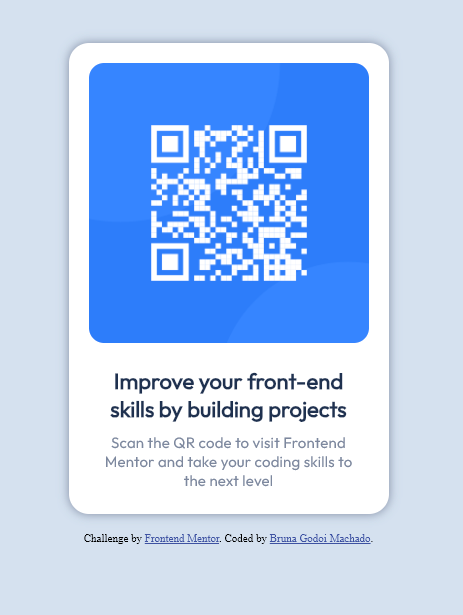

# Frontend Mentor - QR code component solution

This is a solution to the [QR code component challenge on Frontend Mentor](https://www.frontendmentor.io/challenges/qr-code-component-iux_sIO_H). Frontend Mentor challenges help you improve your coding skills by building realistic projects. 

## Table of contents

- [Frontend Mentor - QR code component solution](#frontend-mentor---qr-code-component-solution)
  - [Table of contents](#table-of-contents)
  - [Overview](#overview)
    - [Screenshot](#screenshot)
    - [Links](#links)
  - [My process](#my-process)
    - [Built with](#built-with)
    - [What I learned](#what-i-learned)
    - [Continued development](#continued-development)
  - [Author](#author)
  - [Acknowledgments](#acknowledgments)

## Overview

### Screenshot



### Links

- Solution URL: [Github](https://github.com/BlackDereker/qr-code-component)
- Live Site URL: [Add live site URL here](https://blackdereker.github.io/qr-code-component/)

## My process

### Built with
- Flexbox

### What I learned

I learned how to use flexbox to create a responsive design.

```css
.card__body {
    padding: 0 24px 24px;
    display: flex;
    flex-direction: column;
    justify-content: center;
    align-items: center;
    gap: 10px;
}
```

### Continued development

I want to continue learning about flexbox and grid to create more complex layouts. Implementing HTML5 semantic elements is also something I want to focus on.

## Author

- Frontend Mentor - [@BlackDereker](https://www.frontendmentor.io/profile/BlackDereker)
- Github - [@BlackDereker](https://github.com/BlackDereker)
- LinkedIn - [Bruna Godoi Machado](https://www.linkedin.com/in/brunagodoimachado/)

## Acknowledgments

I would like to thank Frontend Mentor for providing this challenge and the community for the feedback and support.
